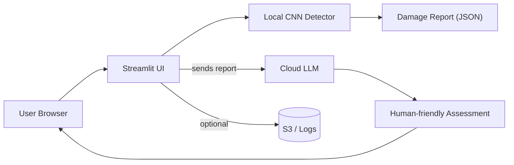

# Project README

## Purpose
This project is a simple application that demonstrates how separate parts of a software system work together: a user interface, a backend service, and a database. It is designed for demonstration, learning, or small internal use.

## Who This Is For
Anyone without technical background who wants a clear, high-level picture of what the project does and where to find key resources.

## Key Resources (What’s Included)
- README.md — this document.
- /src — application source code (frontend and backend).
- /docs — supporting guides and diagrams.
- /config — configuration files (environment settings).
- /data — sample data and database schema.
- /scripts — simple run/deploy scripts.
- Contact: The project owner or team lead (see project metadata).

## How It Works (Simple Flow)
1. A person uses the user interface (web or app).
2. The interface sends a request to the backend service (server).
3. The backend processes the request and reads/writes data from the database.
4. The backend returns results to the interface for display.

## Architecture Diagrams
High-level view (ASCII):
User Interface --> Backend Service --> Database
# CarDamage_Detection — Friendly Guide (Non-Technical + Developer Notes)

## One-line summary
Upload a photo of a car and the app highlights visible damage, explains what it likely means, and suggests repair options and rough cost/time guidance.

## Who this is for
- Non-technical stakeholders: product managers, insurance adjusters, customer support, and decision makers who need clear, plain-English results.
- Developers and data scientists who want to inspect, retrain, or extend the system.

## High-level overview (plain English)
This project detects visible damage on car photos using a trained image model (CNN). It produces a structured report (what part, where, how confident) and asks a large language model (LLM) to turn that report into a friendly summary and suggested next steps. A simple web interface shows annotated images and a chat-like assistant for follow-ups.

## Quick architecture (text)
User (browser) → Streamlit UI (`03_Web_Interface/app.py`) → Local CNN detector (checkpoint in `02_Training/`) → Damage report (JSON)
Streamlit UI → Cloud LLM (via API using `.env` credentials) → Human-friendly assessment → User

### Renderable diagram (Mermaid)


## Step-by-step user flow (non-technical)
1. Open the Streamlit page in your browser.
2. Upload a car photo (or multiple photos).
3. The app runs the detector and overlays bounding boxes with labels (e.g., "front bumper").
4. The app builds a structured report describing each detection (label, location, confidence).
5. The report is optionally sent to a cloud LLM which returns a plain-language summary, suggested repairs, and rough cost/time ranges.
6. The user sees annotated images, a text summary, and can ask follow-up questions in the chat pane.

## What you (the user) receive
- The annotated image(s) with bounding boxes and labels.
- A confidence score for each detection (0.0–1.0).
- A plain-language summary with severity (Minor/Moderate/Severe), recommended repairs, and rough cost/time estimates.
- A chat-like assistant for clarifying questions and next steps.

## Example simplified damage report (JSON)
```json
{
  "image_id": "IMG_0001.jpg",
  "detections": [
    {"label":"front_bumper", "bbox":[100,200,300,150], "score":0.92},
    {"label":"left_door", "bbox":[400,180,220,360], "score":0.75}
  ]
}
```

## Quick start (Windows)
1. Ensure Python 3.8+ is installed.
2. From the project root folder, create/activate a virtual environment and install dependencies:
```powershell
python -m venv .venv
.\.venv\Scripts\Activate.ps1
python -m pip install -r requirements.txt
```
3. Copy and populate environment variables (do not commit `.env`):
```powershell
copy .env.example .env
# then open .env and add cloud keys and model settings
```
4. Start the Streamlit UI:
```powershell
streamlit run "03_Web_Interface/app.py"
```
5. Open the URL printed by Streamlit (usually http://localhost:8501).

## Key files and where to look
- `01_Data/` — images and COCO-style annotation files used for training and evaluation.
- `02_Training/cnn_training.ipynb` — training steps, augmentations, and evaluation notes.
- `02_Training/best_carDD_model.pth` and `best_phase1.pth` — example model checkpoints used for inference.
- `03_Web_Interface/app.py` — web UI, model loading, and prompt/LLM code (functions: `load_model`, `call_bedrock`, `get_initial_assessment`, `get_followup_response`).
- `03_Web_Interface/test.py` — small helpers and usage examples.
- `requirements.txt` — Python packages required to run the project.
- `.env` — environment variables and API keys (private).

## Interpreting outputs (plain language)
- Bounding box: the rectangle that marks the visible damaged area on the image.
- Label: which part the model thinks is damaged (e.g., "rear bumper").
- Confidence: how sure the model is (closer to 1.0 is more confident).
- Severity: a human-friendly level derived from detection and heuristics (estimate only).
- Cost/time: broad, region-independent ranges generated by prompt logic—treat as guidance, not a quote.

## Limitations and important cautions
- Visual-only: the system cannot detect internal or mechanical damage—only what’s visible in images.
- Probabilistic: detections are statistical and may be incorrect (false positives/negatives).
- Dataset dependency: performance depends on the diversity and quality of training images.
- LLM suggestions: wording and cost estimates are produced by the LLM and should be validated by a human expert.
- Privacy: images and prompts may be sent to third-party LLM providers—review provider data policies.

## Privacy & security (practical steps)
- Keep `.env` and any API keys private and out of version control.
- Use least-privilege cloud credentials and restricted roles for production.
- If necessary, avoid sending personally identifying information to external LLMs or use on-premise models.

## Troubleshooting (first steps)
- App fails to start: ensure the virtual environment is active and `pip install -r requirements.txt` ran successfully.
- Model not found: check the checkpoint path in `03_Web_Interface/app.py` and confirm files exist in `02_Training/`.
- LLM call errors: verify `.env` keys, network connectivity, and cloud permissions/billing status.
- Slow inference: initial model load may be heavy—confirm whether a GPU is available and the model is cached.

## How to improve accuracy (suggestions)
- Add more labeled images covering diverse car models, colors, lighting conditions, and damage types.
- Use cross-validation and hold-out test sets to measure improvements.
- Fine-tune model architecture and augmentations in `02_Training/cnn_training.ipynb`.

## Developer pointers (where to change behavior)
- `load_model` in `03_Web_Interface/app.py` — controls how the checkpoint is loaded and cached for inference.
- `call_bedrock` (or equivalent) in `03_Web_Interface/app.py` — wraps the LLM calls and handles prompts.
- `get_initial_assessment` / `get_followup_response` — where prompt design and output parsing live.

## Maintenance & contribution workflow
- To retrain: add labeled images to `01_Data/`, update training notebook in `02_Training/`, export a new `.pth`, and update the path used by the UI.
- To change LLM behavior: edit prompt templates in `03_Web_Interface/app.py` and validate outputs against sample images.
- Use feature branches and PRs; include sample images and expected outputs in tests for any breaking changes.

## FAQ (short)
- Q: Are repair cost estimates exact? A: No — they are rough, model/LLM-derived guidance.
- Q: Can this replace an in-person inspection? A: No — use it for quick triage or pre-assessment.
- Q: Can data be stored? A: Yes. Update the app to persist results to S3 or a database and ensure compliance with privacy rules.

## Contact & reporting issues
- When reporting a problem include: steps to reproduce, a sample image, and terminal logs or errors.
- Repository owner/maintainer details are available in the project metadata.

---

If you'd like, I can also:
- run the app locally and verify the UI starts, or
- commit this change and push to the remote repository.

